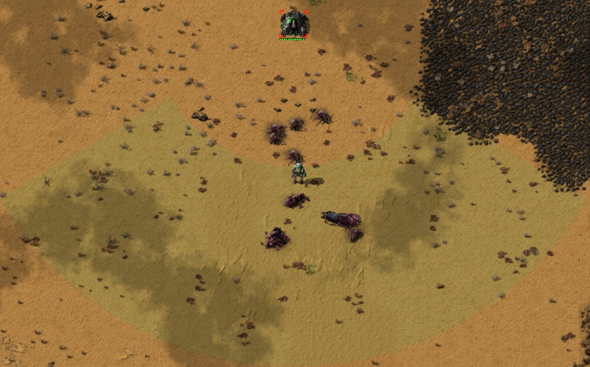

# Directional Rocket Turret

Directional Rocket Turret is a small Factorio tweek that introduces an additional type of rocket turret with a limited and directed range of fire (like the flamethrower turret).

